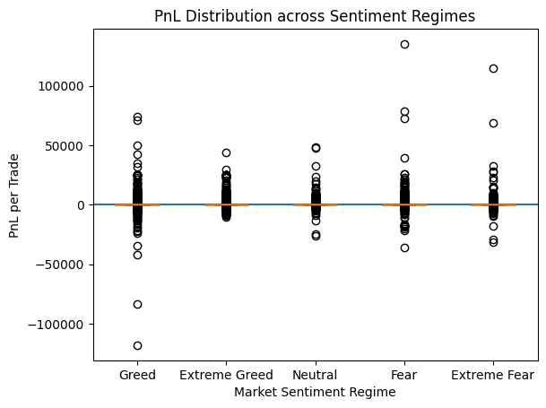
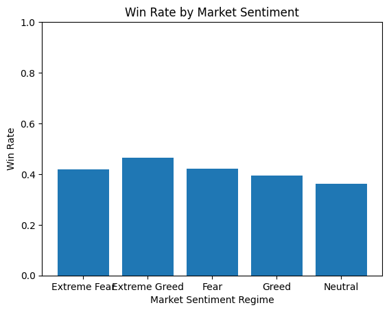

# Sentiment Regimes and Trader Performance Asymmetry

## Overview

This project analyzes how market sentiment regimes influence trader behavior, trade quality, and performance asymmetry. Rather than focusing on aggregate returns, the analysis emphasizes **tail risk**, **trade frequency**, and **skill-dependent adaptation** under different sentiment conditions.

The core objective is to understand **who benefits**, **how they trade**, and **where risk concentrates** across sentiment regimes.

---

## Data Sources

- **Market Sentiment**
  - Daily sentiment classifications:  
    `Extreme Fear`, `Fear`, `Neutral`, `Greed`, `Extreme Greed`
  - Associated numeric sentiment scores and timestamps

- **Trade-Level Execution Data**
  - Timestamped trades with:
    - Execution price
    - Trade size
    - Side (BUY / SELL)
    - Closed PnL
    - Account identifiers

Traders are segmented into **top** and **bottom** groups based on realized profitability.

---

## Key Findings

### 1. Average Trade PnL vs Tail Risk

- Average PnL per trade remains close to zero across all sentiment regimes.
- Sentiment **does not materially impact per-trade expectancy**.
- However, sentiment **strongly reshapes tail risk**:
  - **Greed regimes** exhibit substantially fatter left tails (large downside losses).
  - **Fear regimes** produce occasional extreme positive outcomes.

> Sentiment affects *risk distribution*, not average returns.

---

### 2. Win Rate Stability Across Regimes

- Win rates remain relatively stable across all sentiment regimes.
- Extreme Greed exhibits the **highest win rate**.
- Neutral regimes consistently show the **lowest win rate**.

This indicates that sentiment does not improve directional accuracy, but may influence **conviction and follow-through**.

---

### 3. Trade Frequency vs Trade Quality

**Fear regimes**
- Highest number of trades
- Highest trades per account
- Lowest expected value per trade

> Traders respond to uncertainty by trading more, not better.

Fear regimes are characterized by **high-volume, low-quality trading** with rare extreme winners.

---

**Extreme Greed regimes**
- Fewer trades
- Highest expected value per trade
- Highest win rate
- Significant downside tail risk

> Extreme Greed offers higher profitability but exposes traders to rare catastrophic losses.

---

**Neutral regimes**
- Lowest expected value across all trader segments
- No clear directional structure

> Neutral markets are structurally unprofitable for discretionary traders.

| Sentiment       | Trade Count | Trades per Account | Expected Value |
|-----------------|-------------|--------------------|----------------|
| Extreme Fear    | 21303       | 665.718750         | 50.337228     |
| Extreme Greed   | 40168       | 1338.933333        | 65.104588     |
| Fear            | 61499       | 1921.843750        | 46.635166     |
| Greed           | 48648       | 1569.290323        | 50.145186     |
| Neutral         | 39563       | 1276.225806        | 32.910163     |

---

## Skill-Dependent Behavior

### Key Insight #1 – Selectivity in Extreme Greed

- Top traders significantly **reduce trade frequency** in Extreme Greed.
- They achieve the **highest expected value per trade**.
- Bottom traders fail to reduce activity and underperform.

Same regime. Radically different outcomes.

---

### Key Insight #2 – Fear-Induced Overtrading

- Fear triggers the highest trade frequency across both top and bottom traders.
- Top traders experience deteriorating expected value.
- Bottom traders paradoxically show their **highest average trade profitability**, likely due to volatility-driven price dislocations.

### Key Insight #4 - No Exploitable Structure
- Neutral sentiment regimes consistently deliver the lowest expected value across all trader segments
- Highlighting the absence of exploitable structure and reinforcing the importance of regime awareness in discretionary trading

| Sentiment       | Trade Count per Account (Top Traders) | Expected Value (Top Traders) |
|-----------------|--------------------------------------|-----------------------------|
| Extreme Fear    | 1941.000000                           | 109.660013                  |
| Extreme Greed   | 1272.500000                           | 378.058084                  |
| Fear            | 5086.666667                           | 89.158709                   |
| Greed           | 2312.000000                           | 175.578796                  |
| Neutral         | 3059.333333                           | 54.989291                   |

| Sentiment       | Trade Count per Account (Bottom Traders) | Expected Value (Bottom Traders) |
|-----------------|-----------------------------------------|--------------------------------|
| Extreme Fear    | 774.000000                              | -21.670060                     |
| Extreme Greed   | 638.714286                              | 19.519816                      |
| Fear            | 1328.250000                             | 29.422201                      |
| Greed           | 1210.857143                             | -41.842568                     |
| Neutral         | 619.500000                              | -12.674336                     |

---

### Key Insight #3 – Directional Asymmetry

- Aggregate buy/sell ratios remain stable across regimes.

| Sentiment       | Buy Ratio | Sell Ratio |
|-----------------|-----------|------------|
| Extreme Fear    | 0.466319  | 0.533669   |
| Extreme Greed   | 0.456284  | 0.543710   |
| Fear            | 0.476756  | 0.523240   |
| Greed           | 0.492970  | 0.507025   |
| Neutral         | 0.534135  | 0.465858   |

- When segmented by profitability:
  - **Top traders buy during Fear and sell during Extreme Greed**
  - **Bottom traders lose money by trading with prevailing sentiment**, especially buying during Greed

| Sentiment       | BUY (PnL / EV) | SELL (PnL / EV) |
|-----------------|---------------|----------------|
| Extreme Fear    | 32.672520     | 65.772290     |
| Extreme Greed   | 11.626363     | 109.983201    |
| Fear            | 60.196939     | 34.278313     |
| Greed           | 37.085721     | 62.842505     |
| Neutral         | 24.408029     | 42.658250     |

| Sentiment       | BUY (Top) | SELL (Top) | BUY (Bottom) | SELL (Bottom) |
|-----------------|-----------|------------|--------------|---------------|
| Extreme Fear    | 44.624185 | 169.732749 | -8.708940    | -32.831349   |
| Extreme Greed   | -1.701116 | 529.627726 | 9.007071     | 26.447696    |
| Fear            | 142.261039| 44.334567  | 54.968249    | 11.199739    |
| Greed           | 202.201058| 150.579026 | -80.675167   | 4.972793     |
| Neutral         | 84.483517 | 5.677694   | -37.07743

> Skill manifests as *when not to trade* and *which side to avoid*.

---

## Robustness and Credibility Check

To assess the robustness of the findings, the dataset was independently divided into two disjoint subsets, and the full analysis was replicated on each subset separately.

While the **absolute scale of trade counts, expected values, and PnL metrics differed materially** between the two samples, the **directional insights and regime-dependent behavioral patterns remained consistent** with the full-sample analysis.

In particular:
- The asymmetry between top and bottom traders persisted across sentiment regimes.
- Fear regimes continued to exhibit high trade frequency with deteriorating trade quality.
- Extreme Greed remained characterized by selective participation and strong side-dependent payoffs.
- Neutral regimes consistently showed the weakest structure and lowest expected value.

The second data subset did not contain observations for the *Extreme Greed* regime, which introduced mild imbalance in regime coverage and required careful interpretation. Despite this limitation, **the qualitative conclusions were unchanged**, reinforcing that the observed effects are structural rather than artifacts of a single sample or regime distribution.

This split-sample consistency significantly strengthens the credibility of the analysis and reduces the likelihood that results are driven by overfitting or sample-specific noise.

## Methodological Scope

- This analysis is conducted at the execution level, where each row represents a filled order rather than a fully reconstructed position lifecycle.

- While trade-level reconstruction can provide additional granularity, execution-level analysis remains appropriate for studying behavioral asymmetries, directional bias, and regime-dependent risk concentration, which are the primary focus of this report.

## Conclusion

Market sentiment does not generate universal alpha.  
Instead, it **redistributes opportunity and risk unevenly across traders**.

Performance differences arise from **behavioral adaptation**, not sentiment itself.

---